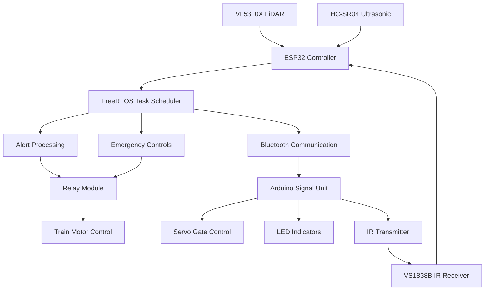

# Railway Accident Prevention System (RAPS)

<div align="center">
  
  
  
  
</div>

<div align="center">
  <p>
    An intelligent railway accident prevention system for collision avoidance, signal detection and rail track monitoring
  </p>
  
  <!-- Badges -->
  <p>
    
    
    
    
    
    
  </p>
   
  <h4>
    <a href="#demo">View Demo</a>
    <span> · </span>
    <a href="#documentation">Documentation</a>
    <span> · </span>
    <a href="https://github.com/your-username/railway-accident-prevention/issues/">Report Bug</a>
    <span> · </span>
    <a href="https://github.com/your-username/railway-accident-prevention/issues/">Request Feature</a>
  </h4>
</div>

<br />

## 📋 Table of Contents

- [About the Project](#about-the-project)
  - [Tech Stack](#tech-stack)
  - [Features](#features)
  - [Architecture](#architecture)
- [Getting Started](#getting-started)
  - [Prerequisites](#prerequisites)
  - [Hardware Requirements](#hardware-requirements)
  - [Installation](#installation)
  - [Circuit Setup](#circuit-setup)
- [Usage](#usage)
- [System Design](#system-design)
- [Testing & Validation](#testing--validation)
- [Performance Metrics](#performance-metrics)
- [Applications](#applications)
- [Contributing](#contributing)
- [License](#license)
- [Contact](#contact)
- [Acknowledgements](#acknowledgements)

## 🚂 About the Project

The Railway Accident Prevention System (RAPS) is a low-cost, embedded solution designed to enhance railway safety through real-time monitoring and automated response systems. The project addresses critical safety challenges including collision avoidance, signal violation detection, and track defect identification.

### Key Highlights

- **Multi-modal Detection**: Combines LiDAR, ultrasonic, and IR sensors for comprehensive hazard detection
- **Real-time Processing**: Built on ESP32 with FreeRTOS for reliable concurrent task execution
- **Wireless Communication**: Bluetooth and IR signaling for robust train-to-infrastructure communication
- **Cost-effective Design**: Uses readily available components for scalable deployment
- **Safety Critical**: Response times of 50-200ms with <2% false alarm rate

### 🛠️ Tech Stack

<details>
  <summary>Embedded Systems</summary>
  <ul>
    <li><a href="https://www.espressif.com/en/products/socs/esp32">ESP32</a> - Main controller for train unit</li>
    <li><a href="https://www.arduino.cc/">Arduino Uno</a> - Signal post and gate control</li>
    <li><a href="https://www.freertos.org/">FreeRTOS</a> - Real-time operating system</li>
    <li><a href="https://www.arduino.cc/en/software">Arduino IDE</a> - Development environment</li>
  </ul>
</details>

<details>
  <summary>Sensors & Hardware</summary>
  <ul>
    <li><a href="https://www.st.com/en/imaging-and-photonics-solutions/vl53l0x.html">VL53L0X LiDAR</a> - Precise distance measurement</li>
    <li><a href="https://www.sparkfun.com/products/15569">HC-SR04 Ultrasonic</a> - Obstacle detection</li>
    <li><a href="https://www.vishay.com/docs/82459/tsop48.pdf">VS1838B IR Receiver</a> - Signal communication</li>
    <li>Servo Motors, Relays, LEDs, Buzzers</li>
  </ul>
</details>

<details>
  <summary>Communication</summary>
  <ul>
    <li>Bluetooth Serial - Primary wireless communication</li>
    <li>Infrared (NEC Protocol) - Fail-safe signaling</li>
    <li>I²C Protocol - Sensor interfacing</li>
  </ul>
</details>

### 🎯 Features

- **Real-time Track Monitoring**: Continuous LiDAR-based track defect detection
- **Obstacle Detection**: Multi-sensor fusion for comprehensive obstacle identification
- **Automatic Collision Avoidance**: Emergency braking with relay-controlled motor cutoff
- **Signal Violation Prevention**: IR-based red signal detection and enforcement
- **Level Crossing Control**: Automated gate operation with servo motors
- **Wireless Coordination**: Bluetooth communication between train and signal units
- **Fail-safe Operation**: IR backup communication when Bluetooth fails
- **Manual Override**: Button controls for system testing and emergency operation

### 🏗️ Architecture

The system employs a dual-microcontroller architecture:

**Train Unit (ESP32)**
- VL53L0X LiDAR sensor for track monitoring
- HC-SR04 ultrasonic sensor for obstacle detection  
- VS1838B IR receiver for signal communication
- Relay module for emergency braking
- Bluetooth communication interface

**Signal Post Unit (Arduino Uno)**
- LED signal indicators (Red/Green)
- Servo motor for gate control
- IR transmitter for train communication
- Push button interface for manual control

## 🚀 Getting Started

### ⚡ Prerequisites

- Arduino IDE (version 1.8.19 or later)
- ESP32 Board Package
- Required libraries (see installation section)

### 🔧 Hardware Requirements

| Component | Quantity | Purpose |
|-----------|----------|---------|
| ESP32 Dev Module | 1 | Main controller for train unit |
| Arduino Uno | 1 | Signal post and gate controller |
| VL53L0X LiDAR Sensor | 1 | High-precision distance measurement |
| HC-SR04 Ultrasonic Sensor | 1 | Backup obstacle detection |
| VS1838B IR Receiver | 1 | Signal communication receiver |
| IR LED | 1 | Signal transmission |
| Relay Module | 1 | Motor control for emergency stop |
| Servo Motor (SG90) | 1 | Gate control mechanism |
| LEDs (Red/Green/Status) | 3 | Visual indicators |
| Buzzer | 1 | Audio alerts |
| Push Buttons | 3 | Manual control interface |
| Breadboard/PCB | 2 | Circuit assembly |
| Power Supply (9V/12V) | 2 | System power |

### ⚙️ Installation

1. **Clone the repository**
```bash
git clone https://github.com/your-username/railway-accident-prevention.git
cd railway-accident-prevention
```

2. **Install required libraries in Arduino IDE**

For ESP32 (Train Unit):
```bash
# Install via Library Manager:
- Adafruit_VL53L0X
- IRremote
- BluetoothSerial (included with ESP32 package)
```

For Arduino Uno (Signal Unit):
```bash
# Install via Library Manager:
- IRremote
- Servo (included with Arduino IDE)
```

3. **Configure ESP32 Board**
- Add ESP32 board URL: `https://dl.espressif.com/dl/package_esp32_index.json`
- Install ESP32 board package
- Select "ESP32 Dev Module" as target board

### 🔌 Circuit Setup

**ESP32 Train Unit Connections:**
```
VL53L0X LiDAR:     SDA→GPIO21, SCL→GPIO22, VCC→3.3V, GND→GND
HC-SR04:           Trig→GPIO5, Echo→GPIO18, VCC→5V, GND→GND
VS1838B IR:        OUT→GPIO15, VCC→3.3V, GND→GND
Relay Module:      IN→GPIO19, VCC→5V, GND→GND
Buzzer:            +→GPIO4, -→GND
LED Indicator:     +→GPIO2, -→GND (via 220Ω resistor)
Button:            One side→GPIO17, Other→GND (with pullup)
```

**Arduino Uno Signal Unit Connections:**
```
Red LED:           Anode→Pin2, Cathode→GND (via 220Ω resistor)
Green LED:         Anode→Pin3, Cathode→GND (via 220Ω resistor)
Push Button:       One side→Pin4, Other→GND (with pullup)
Servo Motor:       Signal→Pin5, VCC→5V, GND→GND
IR LED:            Anode→Pin6, Cathode→GND (via 220Ω resistor)
```

## 📖 Usage

### Basic Operation

1. **Power on both units**
   - ESP32 train unit will initialize sensors and start Bluetooth
   - Arduino signal unit will start in GREEN state

2. **System Control via ESP32**
```bash
# Send via Bluetooth Serial:
"ON"   - Activate the railway safety system
"OFF"  - Deactivate the system
```

3. **Manual Controls**
   - **ESP32 Button**: Toggle system ON/OFF
   - **Arduino Button**: Toggle signal state (RED/GREEN)

### Code Examples

**Basic sensor reading (ESP32):**
```cpp
// Reading LiDAR distance
VL53L0X_RangingMeasurementData_t measurement;
lox.rangingTest(&measurement, false);
if (measurement.RangeStatus == 0) {
    int distance_mm = measurement.RangeMilliMeter;
    if (distance_mm > 50) {
        // Track defect detected
        publishAlert(AlertType::LIDAR_DEFECT);
    }
}
```

**Signal control (Arduino):**
```cpp
void toggleSignal() {
    isRed = !isRed;
    if (isRed) {
        digitalWrite(RED_LED_PIN, HIGH);
        digitalWrite(GREEN_LED_PIN, LOW);
        gateServo.write(90);  // Close gate
        // Send IR signal to train
        irsend.sendNEC(0xAA55, 16);
    } else {
        digitalWrite(RED_LED_PIN, LOW);
        digitalWrite(GREEN_LED_PIN, HIGH);
        gateServo.write(0);   // Open gate
    }
}
```

## 🎨 System Design

### Data Flow Architecture



### State Machine

The system operates with the following states:
- **IDLE**: System off, sensors inactive
- **MONITORING**: Active sensing and communication
- **ALERT**: Hazard detected, emergency braking activated
- **STOPPED**: Train halted, waiting for clearance

## ✅ Testing & Validation

### Test Results

| Test Case | Expected Result | Actual Result | Status |
|-----------|-----------------|---------------|---------|
| Obstacle at 1m (LiDAR) | Emergency stop + alert | ✅ Accurate detection | PASS |
| Obstacle at 3.5m (Ultrasonic) | Secondary detection | ✅ Backup system active | PASS |
| IR Signal Detection | Train stops on red signal | ✅ Immediate response | PASS |
| Bluetooth Communication | Data exchange up to 10m | ✅ Stable connection | PASS |
| Failover to IR | IR backup when BT fails | ✅ Seamless transition | PASS |

### 📊 Performance Metrics

| Parameter | Value/Range | Specification |
|-----------|-------------|---------------|
| **Detection Range** | | |
| LiDAR | 0.03–2 meters | High precision short-range |
| Ultrasonic | 0.02–4 meters | Wide coverage backup |
| **Response Time** | 50–200 ms | Real-time safety compliance |
| **Communication Range** | | |
| Bluetooth | 8–10 meters | Reliable wireless link |
| IR Signaling | Up to 5 meters | Line-of-sight backup |
| **Reliability** | | |
| False Alarm Rate | <2% | Tested over 100+ scenarios |
| System Uptime | >99.5% | Continuous operation validated |
| **Power Consumption** | 250–300 mA @ 5V | Battery/solar compatible |

## 🌟 Applications

- **Level Crossing Automation**: Unmanned crossing safety
- **Track Defect Detection**: Real-time rail monitoring
- **Collision Avoidance**: Multi-sensor obstacle detection
- **Signal Compliance**: SPAD (Signal Passed At Danger) prevention
- **Rural Railway Networks**: Low-cost safety for remote areas
- **Educational/Research**: Embedded systems and IoT demonstrations
- **Smart Railway Infrastructure**: Integration with larger IoT systems

## 🛣️ Roadmap

- [x] ✅ Basic obstacle detection system
- [x] ✅ Multi-sensor integration
- [x] ✅ Wireless communication
- [x] ✅ Real-time task scheduling
- [ ] 🔄 GPS tracking integration
- [ ] 🔄 Cloud-based monitoring
- [ ] 🔄 Mobile app development
- [ ] 🔄 Machine learning predictive maintenance
- [ ] 🔄 Multi-train coordination
- [ ] 🔄 Solar power integration

## 🤝 Contributing

Contributions are always welcome! Please follow these steps:

1. Fork the project
2. Create your feature branch (`git checkout -b feature/AmazingFeature`)
3. Commit your changes (`git commit -m 'Add some AmazingFeature'`)
4. Push to the branch (`git push origin feature/AmazingFeature`)
5. Open a Pull Request

### Code of Conduct

Please read our [Code of Conduct](CODE_OF_CONDUCT.md) for details on our code of conduct and the process for submitting pull requests.

## ⚠️ License

This project is licensed under the MIT License - see the [LICENSE](LICENSE) file for details.


**Project Repository**: [https://github.com/your-username/railway-accident-prevention](https://github.com/your-username/railway-accident-prevention)

## 🙏 Acknowledgements

We express our gratitude to:

- **ESP32 Community** - For excellent documentation and libraries
- **Arduino Community** - For the comprehensive IDE and libraries
- **FreeRTOS Team** - For the robust real-time operating system

### Useful Resources

- [ESP32 Documentation](https://docs.espressif.com/projects/esp-idf/en/latest/)
- [Arduino Reference](https://www.arduino.cc/reference/en/)
- [FreeRTOS Documentation](https://www.freertos.org/Documentation/RTOS_book.html)
- [VL53L0X Sensor Guide](https://learn.adafruit.com/adafruit-vl53l0x-micro-lidar-distance-sensor-breakout)
- [Railway Safety Standards](https://www.iru.org/resources/publications/railway-safety-handbook)

---

<div align="center">
  <strong>🚂 Making Railways Safer Through Innovation 🚂</strong>
  <br>
  <sub>Built with ❤️ using ESP32 and Arduino</sub>
</div>
